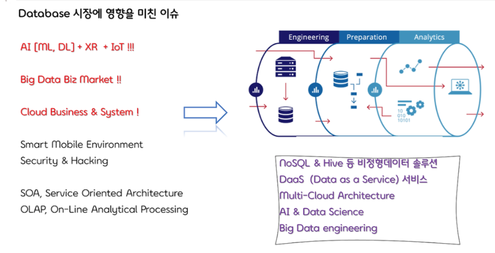
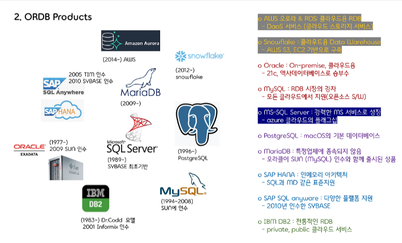
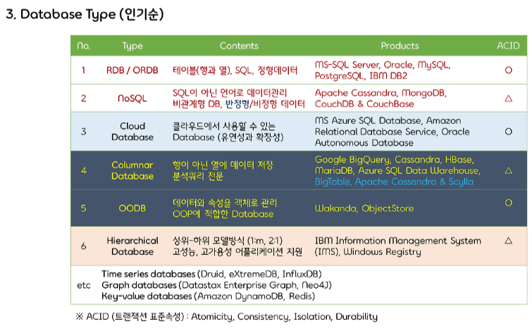

 

 

### 1. 데이터베이스(Database) 시장에 영향을 미친 이슈

 

 

#### 1. 클라우드 컴퓨팅

- 클라우드 기반 데이터베이스 서비스의 등장은 데이터베이스 시장에 큰 영향을 미쳤습니다. 클라우드 데이터베이스는 기업들에게 저렴하고 확장 가능한 데이터베이스 솔루션을 제공합니다.
- 주요 클라우드 데이터베이스 서비스 제공업체로는 Amazon Web Services (AWS), Microsoft Azure, Google Cloud Platform (GCP) 등이 있습니다.

 

#### 2. 빅데이터

- 빅데이터 시대의 도래는 데이터베이스 시장에 새로운 기회를 가져왔습니다. 빅데이터 분석을 위해 기업들은 대규모 데이터을 처리할 수 있는 데이터베이스 솔루션을 필요로 합니다.
-  빅데이터 분석에 사용되는 주요 데이터베이스 기술로는 Hadoop, Spark, Hive 등이 있습니다

 

 

#### 3. NoSQL

- 관계형 데이터베이스 (RDBMS)의 한계를 극복하기 위해 NoSQL 데이터베이스가 등장했습니다. NoSQL 데이터베이스는 비정형화된 데이터, 대규모 데이터, 고성능 데이터 처리 등에 특화되어 있습니다.
- 주요 NoSQL 데이터베이스 종류로는 MongoDB, Cassandra, Redis 등이 있습니다.

 

#### 4. 인공 지능 (Al) 및 머신러닝 (ML)

- Al 및 ML 기술의 발전은 데이터베이스 시장에 새로운 변화를 가져오고 있습니다. Al 및 ML 모델은 데이터베이스에 저장된 데이터를 기반으로 학습하고 예측을 수행합니다.
- Al 및 ML에 사용되는 주요 데이터베이스 기술로는 TensorFlow, PyTorch, scikit-learn 등이 있습니다.

 

#### 5. 보안

- 데이터 보안은 데이터베이스 시장에서 가장 중요한 이슈 중 하나입니다. 기업들은 데이터 유출 및 사이버 공격으로부터 데이터를 보호하기 위한 강력한 데이터베이스 보안 솔루션을 필요로 합니다.
- 주요 데이터베이스 보안 솔루션 제공업체로는 Symantec, McAfee, Trend Micro 등이 있습니다.

 

### 2. ORDB Products

 

- **Oracle Database**: 오라클에서 개발한 객체 관계형 데이터베이스 관리 시스템입니다.
- **IBM DB2**: IBM에서 개발한 객체 관계형 데이터베이스 관리 시스템입니다.
- **Microsoft SQL Server**: 마이크로소프트에서 개발한 관계형 데이터베이스 관리 시스템입니다.
- **PostgreSQL**: 오픈 소스 객체 관계형 데이터베이스 관리 시스템입니다.
- **MySQL**: 오픈 소스 관계형 데이터베이스 관리 시스템입니다.

 

### 3. Database Type(인기순)

#### 1. **관계형 데이터베이스 (RDBMS)**

 가장 일반적인 데이터베이스 유형입니다. 테이블 형식으로 데이터를 저장하고 관리합니다.

 

#### 2. NoSQL 데이터베이스

 비정형화된 데이터, 대규모 데이터, 고성능 데이터 처리 등에 특화된 데이터베이스입니다 .

 

#### 3.**객체 관계형 데이터베이스 (ORDB)**

 객제 지향 프로그래밍 개념을 데이터베이스 관리에 적용한 시스템입니다.

 

#### 4. XML 데이터베이스 

XML 문서를 저장하고 관리하는 데이터베이스입니다.

 

#### 5. 그래프 데이터베이스

 그래프 형식으로 데이터를 저장하고 관리하는 데이터베이스입니다 .